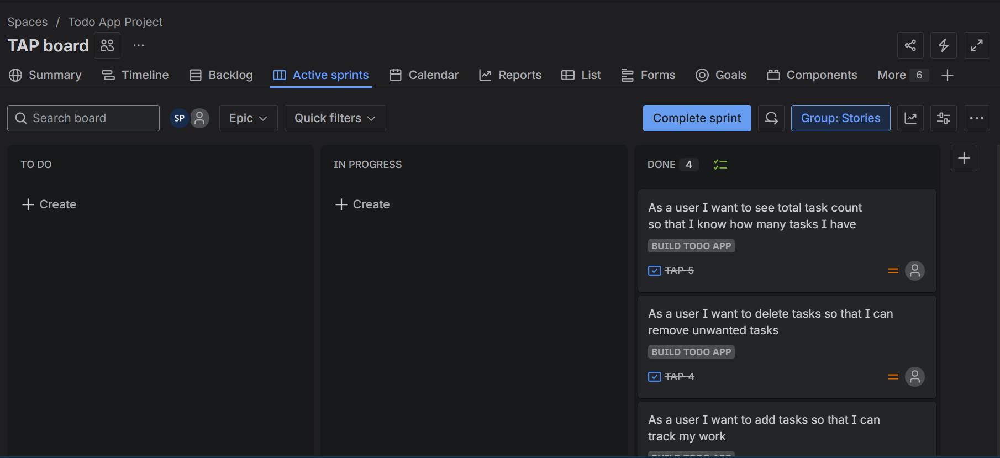
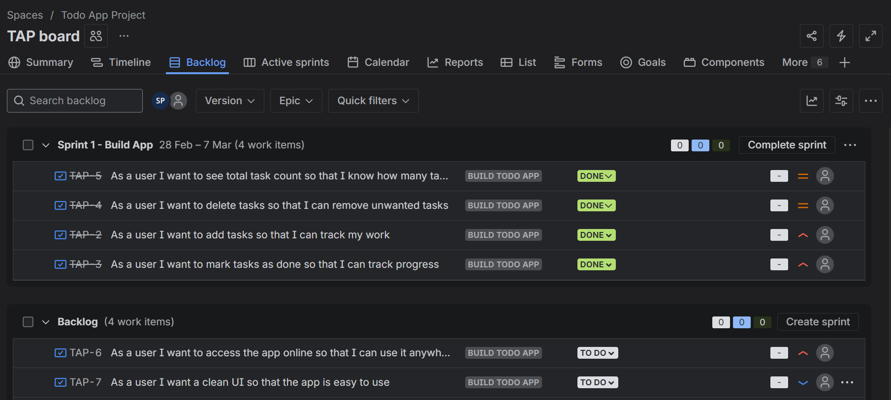
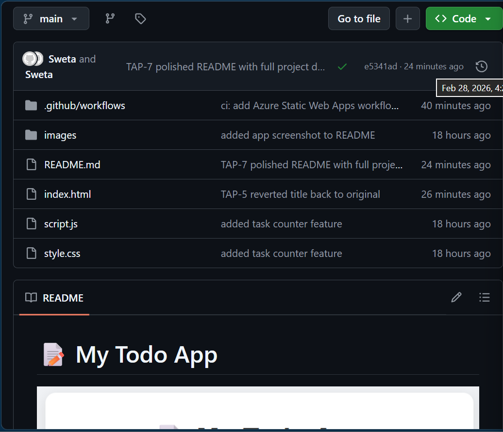
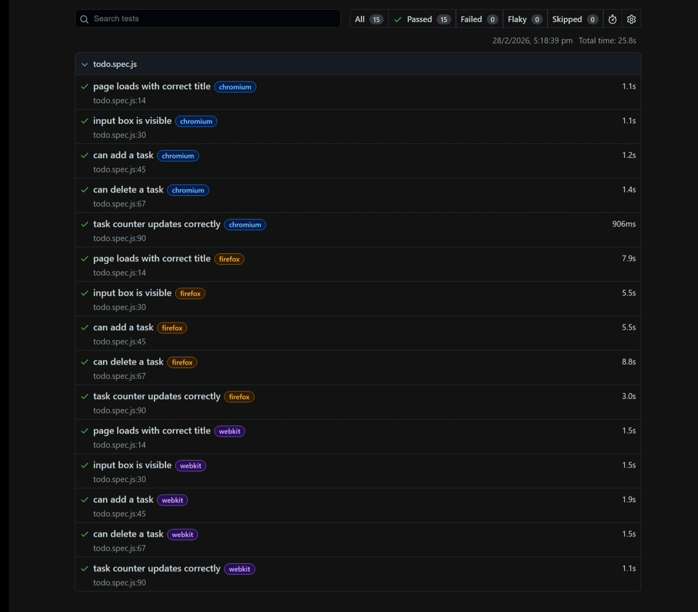
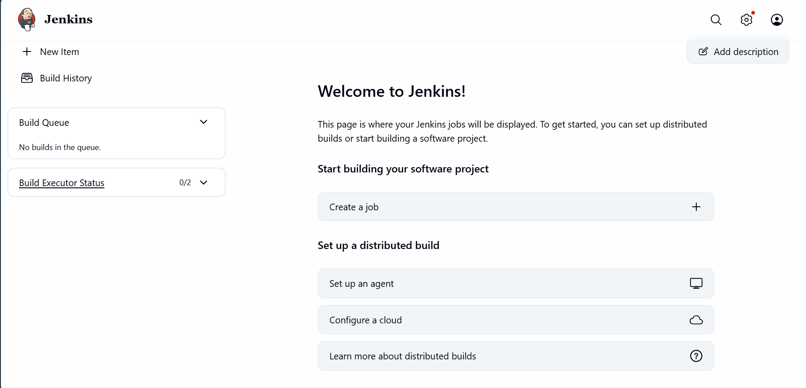
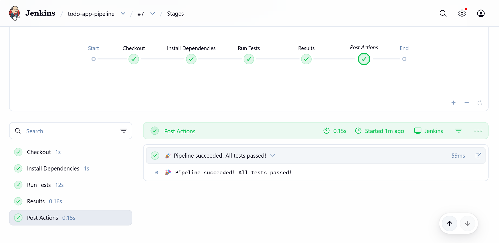
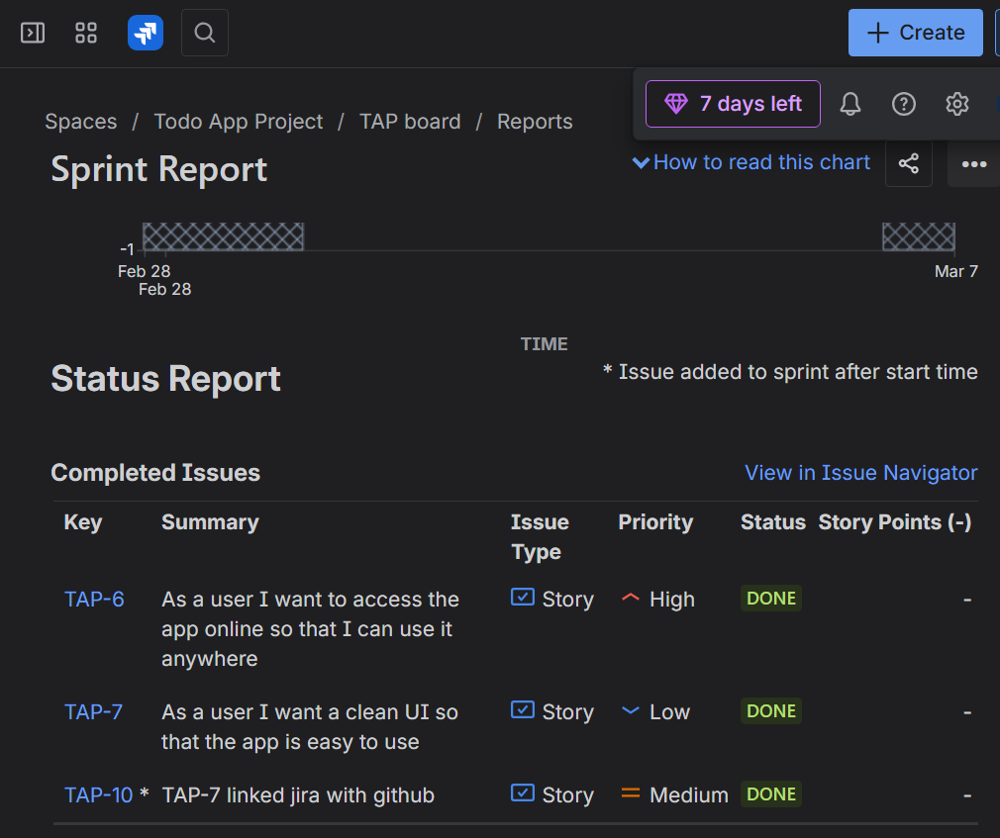

# 📝 My Todo App


## 🌐 Live Demo
👉 [Click here to view live app](https://orange-field-04b13e90f.2.azurestaticapps.net)

## 📌 About This Project
A simple and clean Todo App built as part of my DevOps learning journey.
This project demonstrates a complete DevOps workflow including planning,
development, testing, and cloud deployment.

## ✨ Features
- ✅ Add tasks
- ✅ Mark tasks as Done
- ✅ Delete tasks
- ✅ Task counter
- ✅ Keyboard support (Press Enter to add task)
- ✅ Automated testing with Playwright
- ✅ CI/CD pipeline with Jenkins & Azure

## 🛠️ Technologies Used
| Technology | Purpose |
|-----------|---------|
| HTML | Structure of the app |
| CSS | Styling and design |
| JavaScript | Interactive functionality |
| Git & GitHub | Version control |
| Jira | Project management & sprints |
| Azure Static Web Apps | Cloud deployment |
| Playwright | Automated E2E testing |
| Jenkins | CI/CD pipeline automation |
| Docker | Running Jenkins container |
| DevOps | CI/CD pipeline |
| ALM | Application lifecycle management |

## 📸 Screenshots

### 🌐 Live Todo App


### 📋 Jira Board


### 📋 Jira Backlog


### 💻 GitHub Repository


### 🎭 Playwright Test Report


### 🔧 Jenkins Dashboard


### 🔧 Jenkins Pipeline Success


### 📋 Jira Final - All Stories Done


## 🚀 How to Run Locally
1. Clone the repository
```bash
git clone https://github.com/SwetaPatel04/todo-app.git
```
2. Open `index.html` in your browser
3. Start adding tasks!

## 🧪 How to Run Tests
1. Install dependencies
```bash
npm install
```
2. Run Playwright tests
```bash
npx playwright test
```
3. View test report
```bash
npx playwright show-report
```

## 📋 Project Management
- Managed using **Jira** with Scrum methodology
- 2 Sprints completed
- 7 User Stories delivered
- GitHub integrated with Jira for commit tracking

## 🔄 CI/CD Pipeline
- Code pushed to **GitHub**
- **Jenkins** automatically runs Playwright tests
- **Azure Static Web Apps** auto deploys on every push
- Live URL updates within 2-3 minutes

## 🔄 Application Lifecycle Management (ALM)
This project follows a complete ALM process:

| ALM Phase | What Was Done | Tool Used |
|-----------|--------------|-----------|
| **Planning** | Created user stories & sprints | Jira |
| **Development** | Built app features | VS Code |
| **Version Control** | Tracked all code changes | Git & GitHub |
| **Testing** | Automated E2E tests | Playwright |
| **Deployment** | Deployed app to cloud | Azure |
| **Automation** | CI/CD pipeline setup | Jenkins & Docker |
| **Maintenance** | Auto deploy on every push | Azure CI/CD |

> 💡 ALM is not just a tool — it's the complete process of managing
> an application from idea to deployment. This entire project
> demonstrates ALM in action!

## 👤 Author
**Sweta Patel**
- GitHub: [@SwetaPatel04](https://github.com/SwetaPatel04)

## 📅 Project Status
✅ Sprint 1 Complete — App Built
✅ Sprint 2 Complete — App Deployed
✅ Playwright Tests — 5/5 Passing
✅ Jenkins Pipeline — GREEN ✅
✅ All Jira Stories — DONE ✅
✅ Project Complete! 🎉